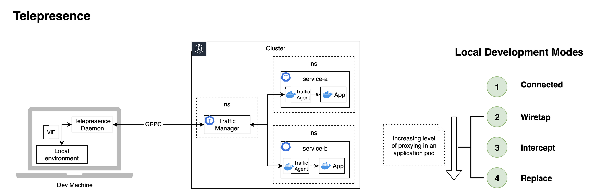

# Telepresence

## Local Development Against Remote Kubernetes Clusters

### How it works · the engage modes · what TLS changes

---

## What We Want to Achieve

- Develop **one service locally** while it talks to the **real cluster** - no full local stack, no build-push-deploy loop
- Keep the **inner loop fast** - edit, run, debug with local tools against live dependencies
- Understand the **engage modes** - how much of a workload you take over, and the trade-offs
- Know where **TLS** changes what's possible

### What We'll Cover

1. The problem and what Telepresence gives you
2. How it works - DNS, routing, the in-cluster components
3. **The engage modes** - a spectrum of increasing proxying
4. Routing within an intercept - global vs personal
5. What app-managed TLS changes

---


# The Problem

---

## Why Telepresence

A microservice rarely runs alone - it depends on databases, queues, and a dozen other services that live in the cluster.

Testing a change usually means one of:

- **Run everything locally** - heavy, brittle, never quite matches the cluster
- **Build → push → redeploy** to test in-cluster - slow inner loop, no local debugger

Telepresence offers a third way:

> Run the **one service** you're working on **locally**, wired transparently into the **real remote cluster** - everything else stays where it is.

---

## What Telepresence Gives You

A tool that connects your **local machine** to a remote Kubernetes cluster:

- **DNS resolution** - use cluster DNS names (`service-a.ns.svc.cluster.local`) from your laptop
- **Network routing** - traffic to cluster IPs is tunneled transparently
- **Engage a workload** - redirect or observe its traffic locally, in several modes
- **Fast inner loop** - local debugger, hot reload, your own tooling, against live cluster dependencies

```
  Local Machine                                       EKS Cluster
  +-------------------+     TLS tunnel via      +------------------------+
  |  Your app         |     kubectl port-fwd    |  Traffic Manager       |
  |  Telepresence     | <=====================  |  Traffic Agent         |
  |  daemon + DNS     |                         |  (injected sidecar)    |
  +-------------------+                         +------------------------+
```

---


# How It Works

---

## Three Things It Sets Up Locally

`telepresence connect` establishes the baseline - **no workload is touched yet**:

- **DNS** - the daemon runs a small DNS server on your laptop (e.g. `127.0.0.1:51011`); the OS resolver is configured to send only *cluster* domains to it, so cluster names resolve locally while normal internet DNS is untouched
- **Routing** - a virtual network interface (VIF) routes the cluster's pod and service subnets through the daemon
- **Secure tunnel** - built on `kubectl port-forward` machinery, TLS-encrypted, to the Traffic Manager

```
  app looks up *.svc.cluster.local
    --> OS resolver matches cluster domain (/etc/resolver/* on macOS)
    --> local DNS server (in daemon) --> resolves via cluster over tunnel
  other lookups (.com/.io/...) --> normal DNS, unchanged

  app --> VIF (cluster subnets) --> tunnel --> cluster
```

This connected state already lets you **call cluster services from your laptop** - outbound only, nothing intercepted.

---

## Local Daemons

Telepresence splits work across two local processes for least-privilege:

- **User Daemon** - runs as your user. Manages intercepts/replaces - the control logic; talks to the Traffic Manager. All cluster requests flow through it.
- **Root Daemon** - runs as root. Owns the system networking: the VIF, routing tables, and the local DNS server.

```
  Root Daemon (root)  ---> VIF + routing + DNS  (system-level changes)
  User Daemon (user)  ---> cluster API + Traffic Manager  (no elevated privileges)
```

Only the networking layer needs root; the cluster-facing logic does not. Component isolation also means one failing process doesn't take down the whole stack.

---

## The Big Picture



- **Daemon → Traffic Manager** over gRPC; the Manager injects a **Traffic Agent** sidecar into the target pods
- **Local Development Modes** are a spectrum of increasing proxying - covered next

---

## In-Cluster Components

- **Traffic Manager** - central coordinator. Installed once by an admin; injects agents and routes traffic to/from daemons
- **Traffic Agent** - a sidecar injected into the target workload's pods. **Every engage mode injects one** - the modes differ in what the agent then does with traffic and the original container
- **gRPC tunnel** - the User Daemon and Traffic Manager exchange control and proxied traffic over the TLS tunnel established at connect time

```
  User Daemon --gRPC/tunnel--> Traffic Manager --injects--> Traffic Agent (in target pod)
```

---


# The Engage Modes

---

## A Spectrum of Increasing Proxying

All four modes inject a Traffic Agent. They differ by **how much of the pod you take over**:

```
  Connected --> Wiretap --> Intercept --> Replace
  (DNS +        (copy of     (filtered     (all traffic,
   outbound      traffic,     subset to     original
   only)         observe)     you)          container removed)

  <------------  increasing level of proxying  ------------>
```

| | Traffic to you | Original container | Volumes |
|---|---|---|---|
| **Connected** | none (outbound only) | n/a - no agent | n/a |
| **Wiretap** | a **copy** | keeps running | read-only |
| **Intercept** | filtered **subset** | keeps running | read-write |
| **Replace** | **all** | **removed** (restored on leave) | read-write |

Workflow: `connect` → `list` → one of `wiretap` / `intercept` / `replace` → `leave`

---

## Connected - DNS + Outbound Only

The baseline from `telepresence connect`. No workload is engaged, no agent injected.

```
  local app --> cluster DNS resolves --> call service-b.ns:8080  [OK]
  (nothing flows back to your laptop)
```

```bash
telepresence connect -n service-a-ns
telepresence status
curl service-b.service-b-ns:8080      # works from your laptop
```

- Use it to **run your service locally** and reach cluster dependencies, without redirecting any cluster traffic to you
- Zero impact on the cluster workloads

---

## Wiretap - Observe a Copy

A **duplicate** of the traffic is sent to your laptop; the original still reaches the in-cluster service.

```
                     +--> in-cluster service (still served)  [OK]
  request --> agent --+
                     +--> copy --> your laptop (observe)
```

- **Original container keeps running**, read-only volume access *(needs FUSE)*
- Local responses **don't affect** the cluster - safe for breakpoints
- Multiple developers can wiretap the **same service** at once, minimal impact
- Use case: inspect real traffic, debug without changing cluster behavior

---

## Intercept - Take a Filtered Subset

Reroutes **matching** requests to your laptop; the original container keeps handling everything else.

```
  request --> agent --+-- matches filter --> your laptop
                      +-- otherwise --------> in-cluster container  [OK]
```

- **Least invasive** redirect - the remote container still runs background tasks and serves unmatched traffic
- Read-write volume access *(needs FUSE)*
- Filter by **HTTP header or path** (the basis for personal intercepts - next section)

```bash
telepresence intercept service-a-deployment --port 8080:8080
```

---

## Replace - Take Over Completely

Reroutes **all** the container's traffic to your laptop, and **removes** the original container from the pod (restored when you `leave`).

```
  request --> agent --> your laptop only
  (original container removed for the duration)
```

- **Most invasive** - the remote container is stopped
- Read-write volume access *(needs FUSE)*; the replaced container's env is available locally
- Use case: the remote container **must** stop - e.g. **queue consumers** (else both it and your laptop consume the same messages), or **workloads with no inbound traffic to filter** (background workers, pollers), where Intercept has nothing to split

```bash
telepresence replace service-a-deployment --port 8080:8080
# --container <name> required for multi-container pods
```

---

## Choosing a Mode

| Mode | Pick it when | Cluster impact |
|---|---|---|
| **Connected** | You only need to call cluster services from local code | None |
| **Wiretap** | You want to observe real traffic without altering behavior | Minimal (copy) |
| **Intercept** | You're developing the service API and want only *your* requests | Low (filtered) |
| **Replace** | The remote container must be stopped (queue consumers, etc.) | High (stopped) |

Start at the **lowest rung that does the job** - less proxying means less disruption to others on the cluster.

---

## A Word on Volumes

Engage modes can mount the remote pod's volumes locally (e.g. mounted Secrets/ConfigMaps), so your local code reads the **same files** the in-cluster container sees - prepended under `$TELEPRESENCE_ROOT`.

**The catch - it needs FUSE:**

- Mounts are implemented with **`sshfs`**, a **FUSE** (Filesystem in Userspace) driver - required on **macOS and Linux**
- **macOS** needs **macFUSE** - a closed-source **kernel extension**; the first mount fails until you approve it in System Settings and **reboot**
- **Linux** needs `sshfs` plus `user_allow_other` in `/etc/fuse.conf`

```bash
telepresence replace service-a-deployment --port 8080:8080 --mount=false
```

> Many locked-down corporate laptops **disallow kernel extensions / FUSE**. If so, run with `--mount=false` - you still get the container's **environment variables**, just not its mounted files.

---


# Routing Within an Intercept

---

## Global vs Personal Intercept

An intercept filters which requests come to you. Two granularities:

### Global - all traffic to your laptop
```bash
telepresence intercept service-a-deployment --port 8080:8080
# every request to service-a now hits your local app
```

### Personal (Header-Based) - only matching requests
```bash
telepresence intercept service-a-deployment --port 8080:8080 --http-header x-dev=local

curl -H "x-dev: local" http://service-a.service-a-ns:8080   # --> your laptop
curl http://service-a.service-a-ns:8080                       # --> cluster pod
```

Multiple developers can intercept the **same service** simultaneously with different header values - no conflicts. *(Personal intercepts require Telepresence ≥ 2.25.)*

---

## The Catch: Personal Intercepts Need Readable Headers

Header-based routing means the Traffic Agent must **read the HTTP headers** to decide where each request goes.

```
  request --> agent reads x-dev header --> routes to you or cluster
                  |
                  +-- only works if the agent can SEE the header
```

- Works with **plain HTTP** - headers are in the clear
- Works with a **service mesh** (Linkerd / Istio) - the app speaks plain HTTP; the mesh proxy handles encryption separately, so the agent still sees plaintext
- **Breaks with app-managed TLS** - the app encrypts end to end, so the agent sees only ciphertext and cannot match headers

This is the bridge to the TLS discussion next.

---


# What App-Managed TLS Changes

---

## App-Managed TLS - The Implications

When the **application itself terminates TLS** (no proxy in between), the traffic on the wire is opaque to Telepresence.

**1. Personal intercepts stop working**
- The agent can't read encrypted headers → only **global intercept** and **replace** redirect correctly

**2. Your local service must present a valid identity**
- Same **SAN** as the in-cluster service (e.g. `service-a.service-a-ns.svc.cluster.local`)
- Chain to the **same root CA** so cluster peers trust it - and so it can verify them
- For mTLS, also a **client cert/key** to authenticate outbound calls

Without a matching cert, the TLS handshake on intercepted traffic **fails** - the caller expects the in-cluster identity.

> Full certificate story - PCA hierarchy, cert-manager, dev-cert issuance - is covered in a separate **App-Managed TLS deck**. Not the focus here.

---


# Wrap-Up

---

## Summary

- **Telepresence = DNS + routing + a tunnel + an injected agent** - run one service locally against the live cluster
- Two local daemons (user / root) split privilege; the **Traffic Manager** coordinates and the **Traffic Agent** does the per-pod work
- **Engage modes are a spectrum of proxying** - pick the lowest rung that does the job:
  - **Connected** - call cluster services, redirect nothing
  - **Wiretap** - observe a copy, change nothing
  - **Intercept** - take a filtered subset, original keeps serving
  - **Replace** - take everything, original stops
- **Personal (header-based) intercepts** need readable headers → plaintext or a mesh; **app-managed TLS** limits you to global intercept / replace and requires a matching dev cert
